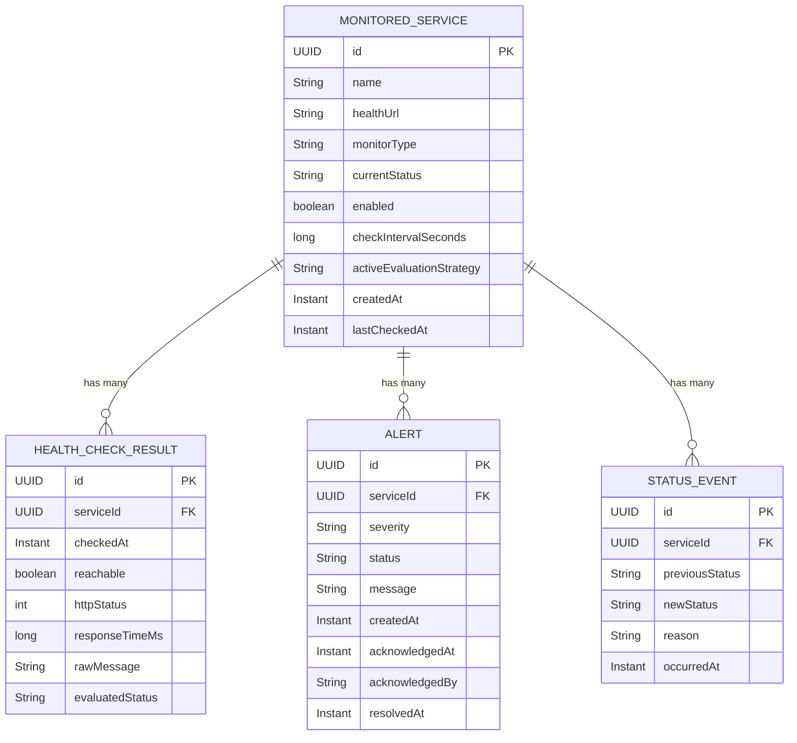

# CloudPulse - Milestone 1

## 1. Project Group Number/Name
**Group number:** 3
**Group name:** CloudPulse Team

**Team members:**
- Katha Patel
- Ashwin Thankachan
- Meet Patel
- Pavithra Prasad

## 2. Project Topic/Name
**CloudPulse - Cloud Service Health Monitoring and Alert Dashboard**

CloudPulse is a full-stack Java application that monitors the availability and response time of application services. It is intentionally a student-scale observability project rather than a replacement for commercial platforms such as Datadog or New Relic.

## 3. Problem Statement
Modern applications are often divided into several services, making it difficult for developers to notice immediately when one service becomes slow or unavailable. Small teams and student developers may not have access to expensive observability platforms, so failures are often discovered only after users report them. CloudPulse will periodically perform real HTTP health checks against registered services and measure their response time and availability. It will classify every service as Unknown, Healthy, Degraded, Down, or Recovered and display the current condition through a React dashboard. When a service changes to an unhealthy state, the application will create an alert and maintain a chronological event history that users can review and acknowledge. The project provides a controlled and demonstrable introduction to monitoring, alerting, state management, and extensible software architecture through meaningful object-oriented design patterns.

## 4. UML Diagram / ER Diagram

### UML Class Diagram

```mermaid
classDiagram
    direction TB

    class MonitoredService {
        +UUID id
        +String name
        +String healthUrl
        +MonitorType monitorType
        +ServiceStatus currentStatus
        +boolean enabled
        +long checkIntervalSeconds
        +EvaluationPolicy activeEvaluationStrategy
        +Instant createdAt
        +Instant lastCheckedAt
    }

    class MonitorType {
        <<enumeration>>
        HTTP
        MOCK
    }

    class EvaluationPolicy {
        <<enumeration>>
        NORMAL
        STRICT
    }

    class HealthCheckResult {
        +UUID id
        +Instant checkedAt
        +boolean reachable
        +int httpStatus
        +long responseTimeMs
        +String rawMessage
        +ServiceStatus evaluatedStatus
    }

    class Alert {
        +UUID id
        +Severity severity
        +AlertStatus status
        +String message
        +Instant createdAt
        +Instant acknowledgedAt
        +String acknowledgedBy
        +Instant resolvedAt
    }

    class StatusEvent {
        +UUID id
        +ServiceStatus previousStatus
        +ServiceStatus newStatus
        +String reason
        +Instant occurredAt
    }

    class ServiceMonitor {
        <<interface>>
        +check(MonitoredService service) HealthCheckResult
    }

    class HttpServiceMonitor
    class MockServiceMonitor

    class MonitorDecorator {
        <<abstract>>
        -ServiceMonitor delegate
    }

    class LoggingMonitorDecorator
    class RetryMonitorDecorator

    class MonitorCreator {
        <<abstract>>
        +createMonitor() ServiceMonitor
    }

    class HttpMonitorCreator
    class MockMonitorCreator

    class HealthEvaluationStrategy {
        <<interface>>
        +evaluate(HealthCheckResult result) ServiceStatus
    }

    class NormalHealthStrategy
    class StrictHealthStrategy

    class ServiceState {
        <<interface>>
        +transition(HealthCheckResult result) ServiceStatus
    }

    class UnknownState
    class HealthyState
    class DegradedState
    class DownState
    class RecoveredState

    class ResultHandler {
        <<abstract>>
        -ResultHandler next
        +setNext(ResultHandler handler)
        +handle(HealthCheckResult result)
    }

    class ResponseValidationHandler
    class AvailabilityHandler
    class LatencyHandler
    class StatusChangeHandler
    class AlertCreationHandler

    class MonitoringObserver {
        <<interface>>
        +onStatusChanged(StatusEvent event)
    }

    class StatusEventPublisher
    class DashboardUpdateObserver
    class AlertObserver
    class EventHistoryObserver

    class MonitoringCommand {
        <<interface>>
        +execute()
    }

    class RunHealthCheckCommand
    class AcknowledgeAlertCommand

    class HealthResponseAdapter {
        <<interface>>
        +adapt(String response) HealthCheckResult
    }

    class StandardHealthAdapter
    class LegacyHealthAdapter

    MonitoredService "1" --> "0..*" HealthCheckResult : produces
    MonitoredService "1" --> "0..*" Alert : raises
    MonitoredService "1" --> "0..*" StatusEvent : records
    MonitoredService --> MonitorType : uses
    MonitoredService --> EvaluationPolicy : uses

    ServiceMonitor <|.. HttpServiceMonitor
    ServiceMonitor <|.. MockServiceMonitor
    ServiceMonitor <|.. MonitorDecorator
    MonitorDecorator o--> ServiceMonitor : wraps
    MonitorDecorator <|-- LoggingMonitorDecorator
    MonitorDecorator <|-- RetryMonitorDecorator

    MonitorCreator <|-- HttpMonitorCreator
    MonitorCreator <|-- MockMonitorCreator
    MonitorCreator ..> ServiceMonitor : creates
    HttpMonitorCreator ..> HttpServiceMonitor : instantiates
    MockMonitorCreator ..> MockServiceMonitor : instantiates

    HealthEvaluationStrategy <|.. NormalHealthStrategy
    HealthEvaluationStrategy <|.. StrictHealthStrategy
    MonitoredService --> HealthEvaluationStrategy : selects

    MonitoredService --> ServiceState : current state
    ServiceState <|.. UnknownState
    ServiceState <|.. HealthyState
    ServiceState <|.. DegradedState
    ServiceState <|.. DownState
    ServiceState <|.. RecoveredState
    ResultHandler <|-- ResponseValidationHandler
    ResultHandler <|-- AvailabilityHandler
    ResultHandler <|-- LatencyHandler
    ResultHandler <|-- StatusChangeHandler
    ResultHandler <|-- AlertCreationHandler
    ResponseValidationHandler --> AvailabilityHandler : next
    AvailabilityHandler --> LatencyHandler : next
    LatencyHandler --> StatusChangeHandler : next
    StatusChangeHandler --> AlertCreationHandler : next
    MonitoringObserver ..> StatusEvent : receives
    MonitoringObserver <|.. DashboardUpdateObserver
    MonitoringObserver <|.. AlertObserver
    MonitoringObserver <|.. EventHistoryObserver
    StatusEventPublisher --> MonitoringObserver : notifies
    MonitoringCommand <|.. RunHealthCheckCommand
    MonitoringCommand <|.. AcknowledgeAlertCommand
    RunHealthCheckCommand ..> MonitoredService : checks
    AcknowledgeAlertCommand ..> Alert : updates
    HttpServiceMonitor --> HealthResponseAdapter : normalizes
    HealthResponseAdapter <|.. StandardHealthAdapter
    HealthResponseAdapter <|.. LegacyHealthAdapter
```

### ER Diagram

## 5. Design Patterns to be Implemented

### Observer Pattern
- **Problem solved:** Several components must react when service health changes without tightly coupling them to the monitoring engine.
- **Implementation:** A status event publisher will notify observers such as `DashboardUpdateObserver`, `AlertObserver`, and `EventHistoryObserver` whenever a service transitions between health states.
- **Visible demonstration:** When Payment Service changes from Healthy to Degraded, the dashboard, alert list, and event timeline all update from the same event.

### Strategy Pattern
- **Problem solved:** Different environments require different definitions of acceptable response time.
- **Implementation:** `NormalHealthStrategy` and `StrictHealthStrategy` will implement a common `HealthEvaluationStrategy` interface. Each `MonitoredService` carries its own `activeEvaluationStrategy`, so different services can be evaluated with different thresholds at the same time. New services will use the application's configured default strategy.
- **Visible demonstration:** The presenter switches Payment Service from Normal to Strict while Notification Service stays on Normal, and the two services classify differently from the same response times without modifying the monitoring engine.

### State Pattern
- **Problem solved:** A service behaves differently depending on its current health condition, and status transitions must be controlled and recorded.
- **Implementation:** `UnknownState`, `HealthyState`, `DegradedState`, `DownState`, and `RecoveredState` will implement a common `ServiceState` interface.
- **Visible demonstration:** Notification Service transitions from Healthy to Down, then to Recovered and Healthy after restoration.

### Factory Method Pattern
- **Problem solved:** The monitoring scheduler should not directly construct every concrete monitor.
- **Implementation:** An abstract `MonitorCreator` will declare the `createMonitor()` factory method. `HttpMonitorCreator` and `MockMonitorCreator` will override that method to create `HttpServiceMonitor` and `MockServiceMonitor` instances without coupling the scheduler to concrete monitor classes.
- **Visible demonstration:** A real HTTP service and a simulated service can be registered through the same UI and processed through the same monitoring workflow.

### Chain of Responsibility Pattern
- **Problem solved:** Health-check processing contains several independent stages that should remain modular and testable.
- **Implementation:** Results will pass through `ResponseValidationHandler`, `AvailabilityHandler`, `LatencyHandler`, `StatusChangeHandler`, and `AlertCreationHandler`.
- **Visible demonstration:** The event details can display which pipeline stages processed a failing health check.

### Command Pattern
- **Problem solved:** User operations should have consistent execution, validation, and audit history.
- **Implementation:** `RunHealthCheckCommand`, `AcknowledgeAlertCommand`, `ResolveAlertCommand`, and `EnableMonitoringCommand` will implement a common command interface.
- **Visible demonstration:** A user acknowledges an alert, and the command is recorded in the alert history with the user and timestamp.

### Adapter Pattern
- **Problem solved:** Services may return different health-response formats.
- **Implementation:** `StandardHealthAdapter` and `LegacyHealthAdapter` will convert different JSON payloads into the common `HealthCheckResult` model.
- **Visible demonstration:** Two demo services return differently structured health responses, but both appear consistently in CloudPulse.

### Decorator Pattern
- **Problem solved:** Monitoring concerns such as logging, retry behavior, and timing metrics should be added without modifying every concrete monitor.
- **Implementation:** `LoggingMonitorDecorator`, `RetryMonitorDecorator`, and `MetricsMonitorDecorator` will wrap a `ServiceMonitor` and add behavior while preserving the same interface.
- **Visible demonstration:** The team enables retry and logging around an HTTP monitor, then shows that a failed check is retried and recorded without changing `HttpServiceMonitor`.

### MVC Architecture
- **Problem solved:** The UI, request handling, business logic, and domain data should remain separated.
- **Implementation:** React provides the View, Spring REST controllers provide the Controller layer, and Java entities/services provide the Model and business layers.
- **Note:** MVC should be described as the application's architectural pattern. It is not one of the original Gang of Four patterns.

## 6. Tech Stack

**Backend**
- Java SE JDK 22, matching the course syllabus
- Spring Boot
- Spring Web / REST controllers
- Spring Scheduler
- Spring Data JPA
- Maven

**Frontend**
- React
- TypeScript
- Vite
- CSS or a lightweight component library selected by the team

**Data and Infrastructure**
- PostgreSQL
- Docker Compose for local database and optional final packaging
- Three minimal Spring Boot demo services

**Testing and Documentation**
- JUnit 5
- Mockito
- Spring Boot integration tests
- Optional Testcontainers for PostgreSQL integration tests
- OpenAPI/Swagger for REST API documentation
- GitHub for version control and pull requests

## 7. Functionalities to be Implemented by the End of Milestone 2
- Add, view, edit, enable, and disable monitored services
- Run scheduled HTTP health checks against registered endpoints
- Run an immediate manual health check
- Record reachability, HTTP status, response time, and timestamp
- Classify services as Unknown, Healthy, Degraded, Down, or Recovered
- Switch between Normal and Strict evaluation strategies
- Generate alerts when a service becomes Degraded or Down
- Acknowledge and resolve alerts
- Display current service health through React status cards
- Display active alerts and chronological status events
- Persist services, checks, alerts, and events in PostgreSQL
- Run three controllable Java demo services
- Implement and demonstrate Observer, Strategy, State, Factory Method, Chain of Responsibility, Command, Adapter, Decorator, and MVC through working code, UML relationships, automated tests, and the final demonstration
- Add unit tests for health evaluation, state transitions, alert generation, and command behavior
- Provide setup instructions and stable demonstration data

## 8. Contributions

| Person Name | Contribution |
|---|---|
| Katha Patel | Monitoring engine and demo services — HTTP monitors, monitor creators, response adapters, monitor decorators, demo endpoints, and unit tests (Factory Method, Adapter, Decorator) |
| Ashwin Thankachan | Health evaluation and lifecycle — threshold strategies, controlled state transitions, recovery logic, and unit tests (Strategy, State) |
| Meet Patel | Processing and alert workflow — processing handlers, alert acknowledgement and resolution commands, persistence, and tests (Chain of Responsibility, Command) |
| Pavithra Prasad | React dashboard and service registration — dashboard, service and alert views, event updates, API integration, and UI tests (Observer, MVC) |

## 9. GitHub Repository
**Repository URL:** https://github.com/KathaPatel29/csye6300-summer26-group3-final-project

**Repository access:** All four team members and TA are added as collaborators.
